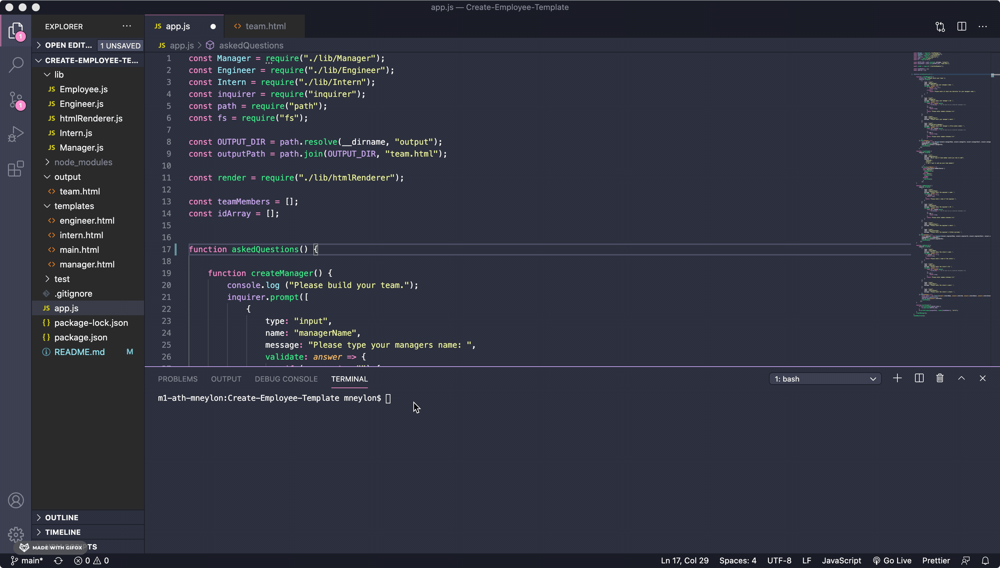
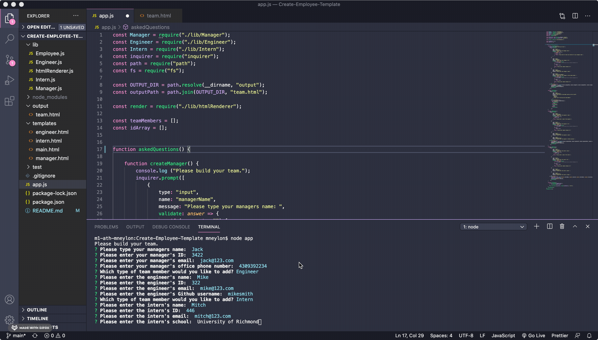
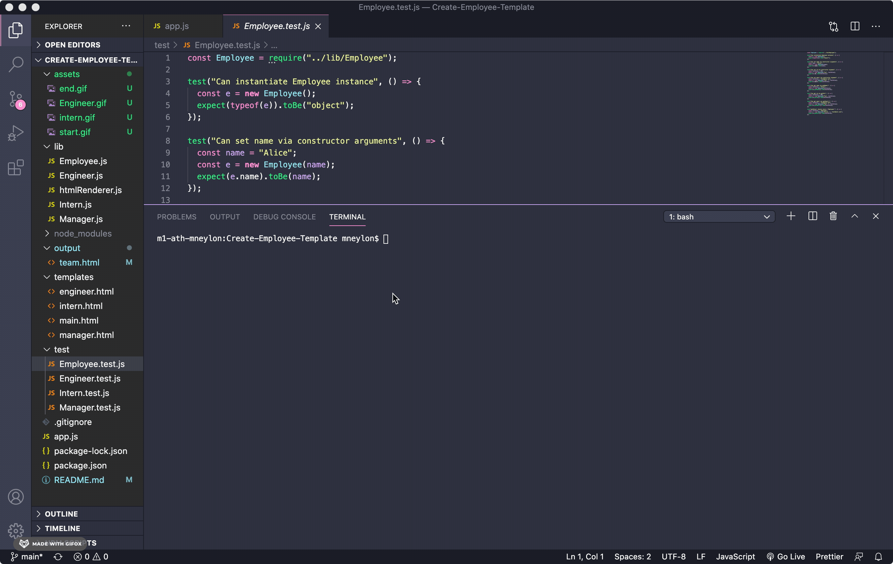
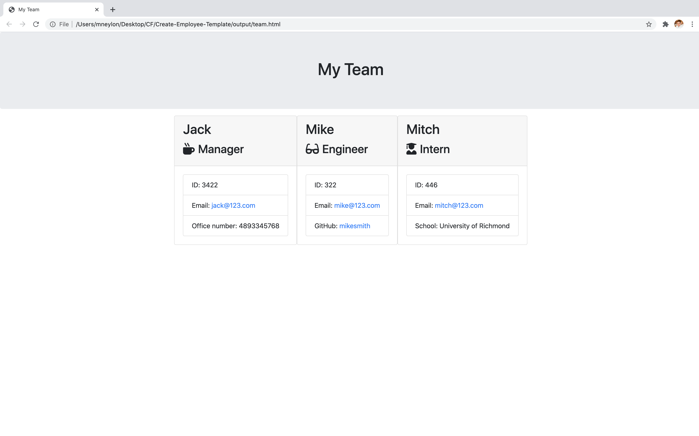

# Template Engine - Employee Summary
### Description
  Node CLI that takes in information about employees and generates an HTML webpage that displays summaries for each person.
## Table of Contents
  
* [Installation](#installation)
* [Usage](#usage)
* [License](#license)
* [Contributing](#contributing)
* [Tests](#tests)
* [Questions?](#questions)

## Installation
  ```
  npm install
  ```
  
## Usage
  The user will need to type $node app to start the application. The user will then answer the questions provided about their manager.
  

  The application will then ask if the user would like to add an engineer or intern team member and answer the questions provided. 
   

  If the user selects "I don't want to add any more team members", the application will end. 
   

   Once the application ends, an HTML file will be dynamically created with the information provided by the users answers.
   
    


## License
  [](https://opensource.org/licenses/MIT)
  
## Contributing
  N/A
  
## Tests
  To run test, the user will have to type $npm run test . 
   
  
## Questions? Contact Me
  * GitHub: [neylonmc]("https://github.com/neylonmc")
  * Email: [neylonmc@gmail.com]("mailto:neylonmc@gmail.com") 